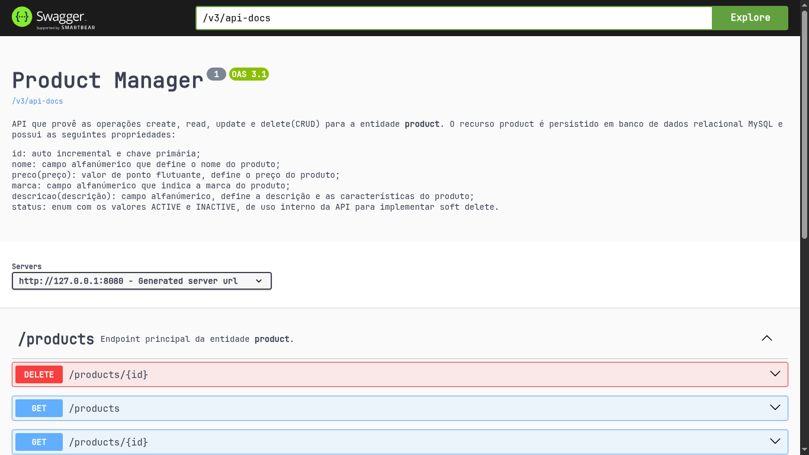

# Product-Manager

Product-Manager é uma API backend que gerencia produtos e seus dados.

### Principais características:

- Persitência de dados em banco de dados relacional MySQL;
- Desenvolvimento de todas as operações CRUD: busca, criação, atualização e deleção;
- Implementação de Soft Delete visando auditorias posteriores.

</br>

# Stack

Este projeto utiliza as seguintes tecnologias:

- Java 21
- Spring Boot 4.0.0
- Spring Web
- MySQL
- Spring Data JPA
- Flyway
- SpringDoc OpenAPI (Swagger)

</br>

# Arquitetura

O projeto segue uma arquitetura em camadas, sendo elas:

- Controller: Responsável por lidar com requisições e respostas HTTP;
- Service: Performa as operações CRUD seguindo as regras de negócio definidas;
- Repository: Oferece as funções utilizadas no Service para se comunicar com o banco de dados;
- Entity: Realiza o mapeamento da entidade `product` no banco de dados;
- Domain: Estabelece regras de negócio;
- DTO: Realiza transferência de dados bi-direcionnal [ Client <-> API ] 
- Response: Define padrões de respostas;
- Security: Gerencia todo o tratamento de erros da aplicação.

</br>

# Setup da Aplicação

1. Os programas e ambientes de execução citados abaixo são necessários:

- Java v21
- MySQL (preferencialmente na versão mais atualizada)

OBS: O projeto inclui Maven Wrapper, portanto o Maven não se torna um requisito obrigatório.

2. Segue o comando para baixar o código fonte:

```
git clone https://github.com/juansgdev/Product-Manager.git
```

3. As demais configurações são necessárias para o ambiente de execução:

No MySQL crie o banco de dados products:
```
create database products;
```

Configure a conexão com o MySQL no arquivo src/main/resources/application.properties do código fonte, substituindo as propriedades das linhas 3 a 7 de acordo com:
```
spring.datasource.url=jdbc:mysql://localhost:SUAPORTA/products

spring.datasource.username=SEUUSUARIO

spring.datasource.password=SUASENHA
```

OBS: Substitua SUAPORTA, SEUUSUARIO, SUASENHA pelos valores correspondentes ao ambiente de execução específico.

4. Para empacotar e finalmente executar a aplicação, na pasta raiz do projeto execute:

```
./mvnw clean package   (ou ./mvnw.cmd clean package, para windows)

java -jar target/productmanager-0.0.1-SNAPSHOT.jar
```

Ao final dos procedimentos a API estará disponível em http://localhost:8080/products

</br>

# Documentação

O projeto conta com uma página de documentação Swagger disponível em http://localhost:8080/swagger-ui/index.html ao executar a aplicação.

<p align="center">
  
</p>

Nesta página encontram-se demais informações sobre a aplicação, bem como exemplos de uso de todas operações suportadas.

</br>

# Sobre

Este projeto foi desenvolvido pelo usuário juansgdev para a segunda avaliação da matéria de Desenvolvimento de Sistemas da instituição Firjan SENAI Maracanã.
